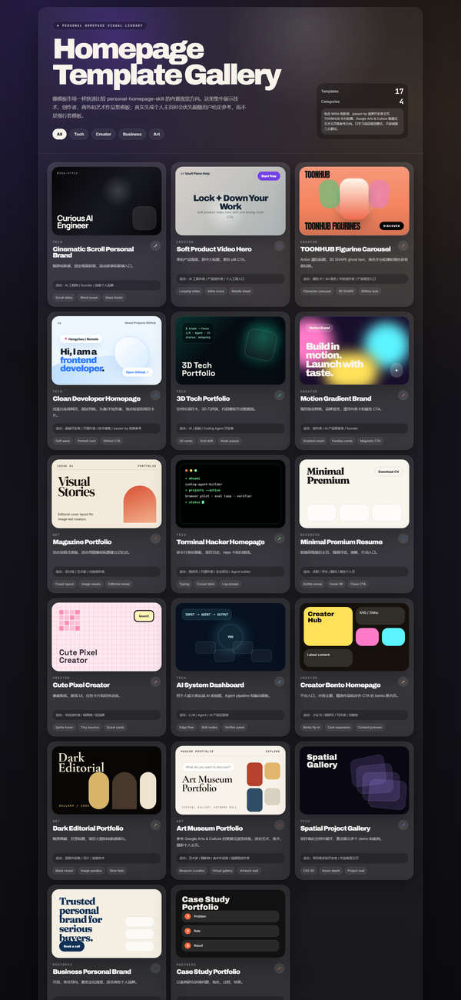

# personal-homepage-skill

一个用于生成高质量个人主页的 AI Skill。

它不是普通的“主页生成器”，而是一套面向 AI Coding Agent 的个人主页质量控制工作流：帮助 Agent 生成个人品牌主页、作品集、简历主页、创作者主页、开发者主页、设计师主页、艺术 / 摄影作品主页，以及以个人项目为核心的展示页。

## 解决什么问题？

很多 AI 生成的个人主页都会变成同一种廉价 SaaS 官网：

- 首屏文案空泛，看不出这个人是谁
- 到处是紫色渐变和随机发光球
- 技能区只是 logo 墙
- 项目卡片没有问题、角色、功能、结果
- 编造虚假指标和虚假评价
- 视觉参考被忽略
- 页面像 PPT 一屏一屏堆起来，不像真实网页

`personal-homepage-skill` 的目标是让 Agent 在生成个人主页时遵守更严格的规则：先理解人，再跟随参考，再组织信息架构，最后做视觉和内容质量检查。

## 核心原则

### 1. 用户给参考，就优先跟随参考

如果用户提供了具体模板、参考网站、截图描述、详细 Prompt 或 GitHub 作品集模板，Agent 必须优先跟随该参考，而不是先让用户从 3 个自己生成的风格里选。

需要保留参考的：

- 信息架构
- 视觉节奏
- 组件组织方式
- 字体气质
- 间距关系
- 动效模型

### 2. 方向不清楚时，才给真实预览

如果用户没有明确视觉方向，Agent 可以给 2-3 个真实主页首屏预览方向。

预览必须像真实个人主页，而不是选项卡片。视觉画面里不能出现：

- Option A / B / C
- template name
- pros / risks
- workflow notes
- file name
- 内部说明文字

### 3. 每个主页都必须回答 5 个问题

1. 这个人是谁？
2. 他 / 她做什么？
3. 有哪些项目、内容、经历或作品能证明？
4. 为什么访问者应该信任？
5. 访问者下一步应该点击哪里？

### 4. 页面必须像真实网页，不像 PPT 拼接

Skill 会检查：

- 没有硬背景断层
- 没有一屏一屏的 PPT 式断点
- 没有每个 section 都换一块无关背景
- 有统一的页面背景、纹理、动效和视觉语法

## 内置模板预览

下面这张图直接由 `demo/template-gallery.html` 导出，展示当前 Skill 内置模板总览。实际生成主页时，Agent 会优先跟随用户给定参考；模板只在方向不清楚或用户主动选择时使用。



可交互 Gallery：

```text
demo/template-gallery.html
```

## 重点模板方向

### Cinematic Scroll Personal Brand

适合 AI 工程师、独立开发者、Founder、高级个人品牌主页。

特点：暗黑电影感、固定视频背景、滚动驱动叙事、稀疏排版、Manrope + JetBrains Mono、玻璃质感 footer。

### Clean Developer Homepage

适合前端开发者、开源作者、技术博客作者。

特点：浅蓝白连续网页、简洁导航、头像 / 手绘形象、地点标签、About、GitHub CTA、项目卡片。该方向学习 passer-by.com 的高层排版节奏，但不复制源码、头像、logo、文案或项目数据。

### TOONHUB Figurine Carousel

适合潮玩 IP、3D 角色、年轻创作者、强视觉产品入口。

特点：Anton 大标题、`3D SHAPE` ghost text、手办角色轮播、强色彩背景切换、650ms 导航锁。

### Art Museum Portfolio

适合艺术、美术、摄影、策展式个人主页。

特点：美术馆纸感背景、策展式作品墙、艺术家 / 媒介 / 地点 / 主题分类、搜索和故事入口。该方向只学习 Google Arts & Culture 的高层体验模式，不复制其作品、图片、文案、数据或页面结构。

## 文件结构

| 文件 | 作用 |
| --- | --- |
| [SKILL.md](SKILL.md) | Skill 主入口和 Agent 工作流 |
| [STYLE_PRESETS.md](STYLE_PRESETS.md) | 视觉模板库 |
| [CINEMATIC_SCROLL_TEMPLATE.md](CINEMATIC_SCROLL_TEMPLATE.md) | WISA 风格暗黑电影感模板说明 |
| [MOTION_PATTERNS.md](MOTION_PATTERNS.md) | 动效、3D、背景和降级规则 |
| [HOMEPAGE_SECTIONS.md](HOMEPAGE_SECTIONS.md) | 页面 section 内容规则 |
| [COMPONENT_PATTERNS.md](COMPONENT_PATTERNS.md) | 组件实现模式 |
| [DATA_SCHEMA.md](DATA_SCHEMA.md) | 个人主页数据结构 |
| [DESIGN_REVIEW.md](DESIGN_REVIEW.md) | 最终设计检查清单 |
| [REFERENCE_PRODUCTS.md](REFERENCE_PRODUCTS.md) | 参考产品和版权边界 |
| [PRD.md](PRD.md) | 内部产品需求文档 |
| [OPEN_SOURCE_PRD.md](OPEN_SOURCE_PRD.md) | GitHub 开源版本 PRD |
| [USER_STORIES.md](USER_STORIES.md) | 用户故事和验收标准 |
| [TEST_SCENARIOS.md](TEST_SCENARIOS.md) | Skill 行为测试场景 |
| [TASK_BREAKDOWN.md](TASK_BREAKDOWN.md) | 后续开发任务拆解 |
| [TECHNICAL_ROUTE.md](TECHNICAL_ROUTE.md) | 推荐技术路线 |
| [OPEN_SOURCE_CHECKLIST.md](OPEN_SOURCE_CHECKLIST.md) | 开源发布检查清单 |
| [CONTRIBUTING.md](CONTRIBUTING.md) | 贡献指南 |
| [DEMO_SCRIPT.md](DEMO_SCRIPT.md) | 演示讲稿 |
| [examples/PROMPTS.md](examples/PROMPTS.md) | 示例 Prompt |
| [demo/personal-homepage-skill-overview.html](demo/personal-homepage-skill-overview.html) | 自包含 HTML 演示 Deck |
| [demo/template-gallery.html](demo/template-gallery.html) | 自包含模板 Gallery |
| [assets/template-previews/](assets/template-previews/) | 17 张模板预览图片 |

## 示例 Prompt

### AI 工程师个人主页

```text
帮我生成一个个人主页。我是 AI 工程师，方向是 Agentic Search、Coding Agent 和 AI 产品实践。
项目包括 Search Agent、SlidePage 和 BossHunter。
页面要像高级数字名片，不要像 SaaS 官网。GitHub、小红书、公众号先用占位符。
```

### 严格跟随电影感参考

```text
严格按照这个视觉要求做个人主页：暗黑电影感、固定全屏视频背景、滚动驱动视频、Manrope + JetBrains Mono、稀疏排版、玻璃质感 footer。
不要重新发明视觉风格。
```

### 清爽开发者主页

```text
帮我做一个前端开发者个人主页，参考 passer-by.com 那种清爽排版：浅蓝白背景、简洁导航、头像/手绘形象、地点标签、About、GitHub CTA、项目卡片。
```

更多示例见：[examples/PROMPTS.md](examples/PROMPTS.md)

## 如何使用

把这个文件夹放到兼容的 skills 目录中，例如：

```text
.claude/skills/personal-homepage-skill/
```

然后让 Agent 生成或优化个人主页即可。

这个仓库是 documentation-first Skill，不需要 `npm install`。

## 演示材料

打开演示 Deck：

```text
demo/personal-homepage-skill-overview.html
```

打开模板 Gallery：

```text
demo/template-gallery.html
```

Deck 用于讲解 Skill 的目标、工作流和质量规则。Gallery 用于浏览所有内置模板方向。

Deck 快捷键：

- 右方向键 / Space：下一页
- 左方向键：上一页
- Home：第一页
- End：最后一页

演示讲稿：[DEMO_SCRIPT.md](DEMO_SCRIPT.md)

## 版权和素材边界

这个 Skill 会学习公开设计模式和用户授权参考，但不会授予复制第三方资产的权限。

规则：

- 不复制付费模板、专有代码、私人截图或许可证不明确的资产。
- 不复制 MotionSites 的付费模板、代码、文案、Prompt、图片或精确模板结构。
- 不复制 Google Arts & Culture 的图片、艺术品、文案、收藏数据或精确页面结构。
- 不复制 passer-by.com 的源码、头像、logo、文案或项目数据。
- 如果复用开源代码，必须检查许可证并保留署名。

更多说明见：[REFERENCE_PRODUCTS.md](REFERENCE_PRODUCTS.md)

## 路线图

### V1：文档型 Skill

- Skill 主入口
- 视觉模板库
- 动效模式
- section 规则
- 组件模式
- 数据结构
- 设计检查清单
- PM 文档
- 示例 Prompt
- 演示 Deck
- 模板 Gallery
- 模板预览图片

### V2：可运行模板

- React + Tailwind 示例
- 单文件 HTML 示例
- Next.js App Router 示例

### V3：自动化校验

- Markdown 链接检查
- 生成主页质量检查
- 截图校验辅助工具
- 移动端和 reduced-motion 检查

## 贡献

见 [CONTRIBUTING.md](CONTRIBUTING.md)。

## License

MIT. See [LICENSE](LICENSE).
