# personal-homepage-skill

一个用于生成高质量个人主页与 HTML 演示文稿的 AI Skill。

它不是普通的“主页生成器”，而是一套面向 AI Coding Agent 的个人展示质量控制工作流：帮助 Agent 生成个人品牌主页、作品集、简历主页、创作者主页、开发者主页、设计师主页、艺术 / 摄影作品主页、HTML PPT，以及以个人项目为核心的展示页。

> 如果这个项目帮助你生成了更好的个人主页、作品集、创作者主页或 HTML 演示文稿，欢迎点一个 ⭐ Star。

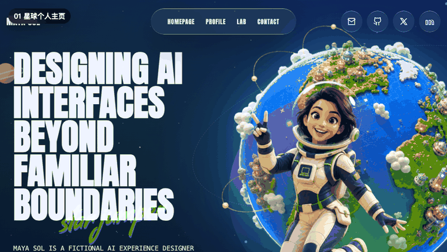

## 解决什么问题？

很多 AI 生成的个人主页都会变成同一种廉价 SaaS 官网：

- 首屏文案空泛，看不出这个人是谁
- 到处是紫色渐变和随机发光球
- 技能区只是 logo 墙
- 项目卡片没有问题、角色、功能、结果
- 编造虚假指标和虚假评价
- 视觉参考被忽略
- 页面缺少统一的视觉系统和内容层次

`personal-homepage-skill` 的目标是让 Agent 在生成个人主页或 HTML 演示文稿时遵守更严格的规则：先理解人和内容目标，再跟随参考，再组织信息架构，最后做视觉和内容质量检查。

## 核心原则

### 1. 用户给参考，就优先跟随参考

如果用户提供了具体模板、参考网站、截图描述、详细 Prompt 或 GitHub 作品集模板，Agent 必须优先跟随该参考，而不是先让用户从 3 个自己生成的风格里选。

需要保留参考的：

- 信息架构
- 视觉节奏
- 组件组织方式
- 字体气质
- 间距关系
- 动效模型

### 2. 方向不清楚时，才给真实预览

如果用户没有明确视觉方向，Agent 可以给 2-3 个真实主页首屏预览方向。

预览必须像真实个人主页，而不是选项卡片。视觉画面里不能出现：

- Option A / B / C
- template name
- pros / risks
- workflow notes
- file name
- 内部说明文字

### 3. 每个主页都必须回答 5 个问题

1. 这个人是谁？
2. 他 / 她做什么？
3. 有哪些项目、内容、经历或作品能证明？
4. 为什么访问者应该信任？
5. 访问者下一步应该点击哪里？

### 4. 输出形式要匹配用户目标

Skill 同时支持连续网页和 HTML 演示文稿。Agent 需要先判断用户要的是个人主页、作品集页面，还是 16:9 演示文稿，再选择对应的信息密度、版式节奏、交互方式和质量检查标准。

## 内置模板预览

这些图片会随仓库一起发布，方便在 GitHub 上直接看到模板方向。实际生成主页时，Agent 会优先跟随用户给定参考；模板只在方向不清楚或用户主动选择时使用。

| 模板 | 预览 |
| --- | --- |
| Cinematic Scroll Personal Brand | 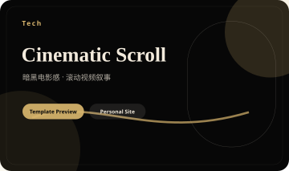 |
| Soft Product Video Hero | 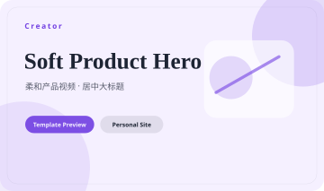 |
| TOONHUB Figurine Carousel | 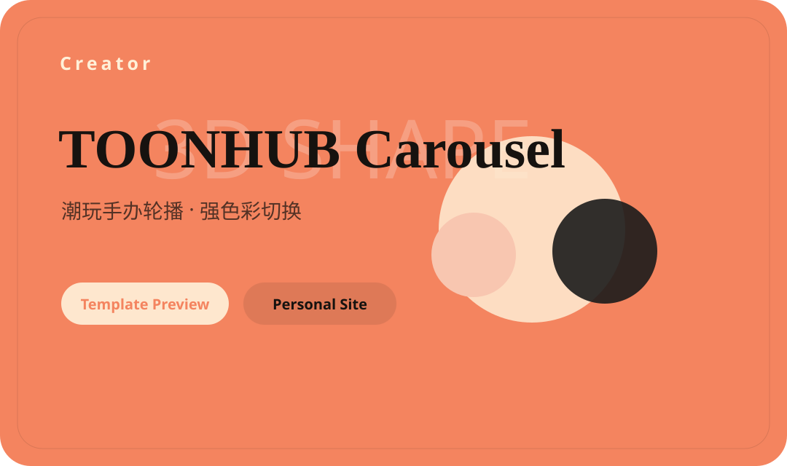 |
| Clean Developer Homepage | 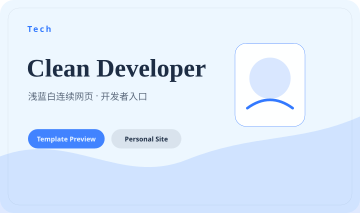 |
| 3D Tech Portfolio | 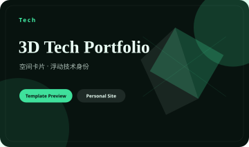 |
| Motion Gradient Brand | 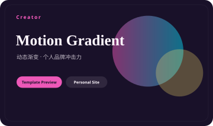 |
| Magazine Portfolio | 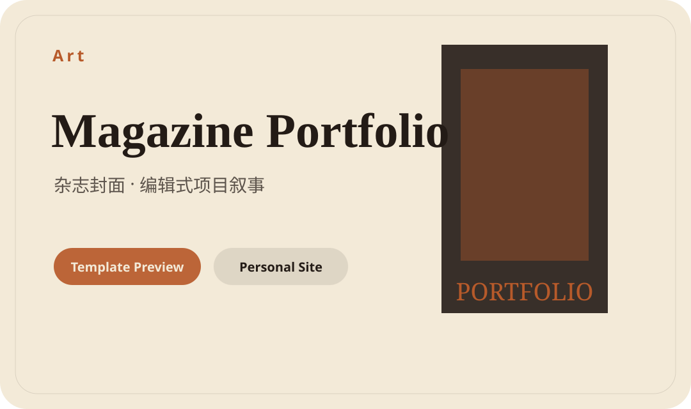 |
| Terminal Hacker Homepage | 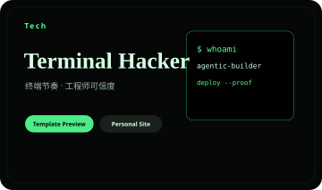 |
| Minimal Premium Resume | 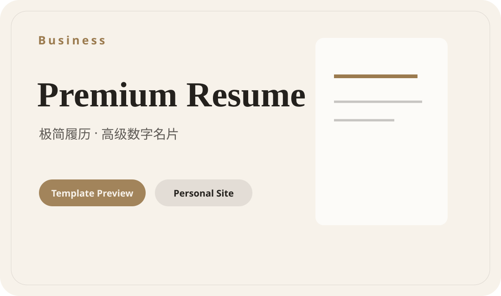 |
| Cute Pixel Creator | 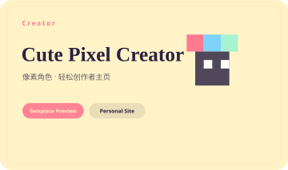 |
| AI System Dashboard | 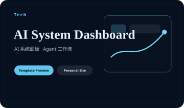 |
| Creator Bento Homepage | 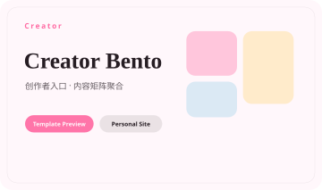 |
| Dark Editorial Portfolio | 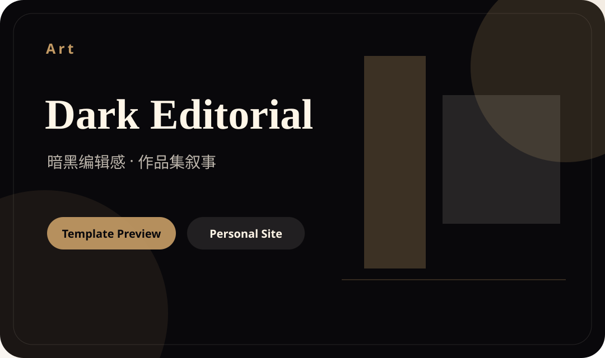 |
| Art Museum Portfolio | 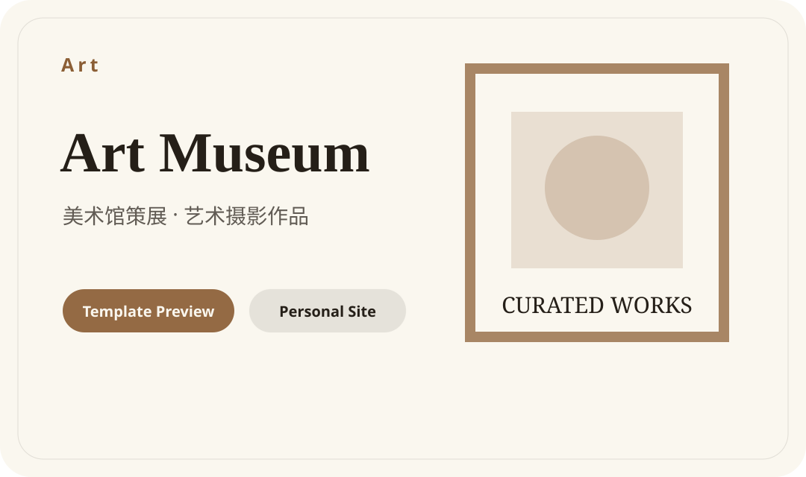 |
| Spatial Project Gallery | 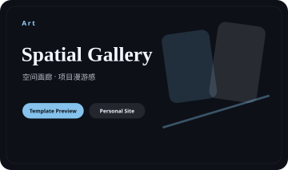 |
| Business Personal Brand | 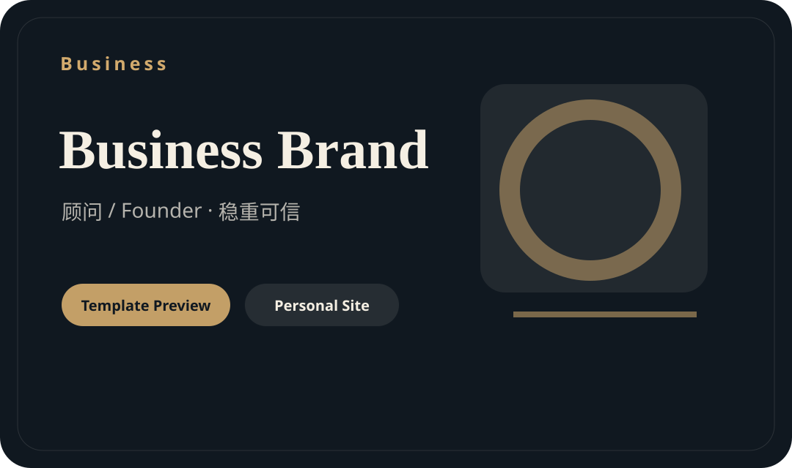 |
| Case Study Portfolio | 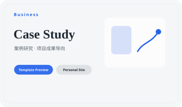 |

更完整的可交互 Gallery：

```text
demo/template-gallery.html
```

## 文件结构

| 文件 | 作用 |
| --- | --- |
| [SKILL.md](SKILL.md) | Skill 主入口和 Agent 工作流 |
| [STYLE_PRESETS.md](STYLE_PRESETS.md) | 视觉模板库 |
| [CINEMATIC_SCROLL_TEMPLATE.md](CINEMATIC_SCROLL_TEMPLATE.md) | WISA 风格暗黑电影感模板说明 |
| [MOTION_PATTERNS.md](MOTION_PATTERNS.md) | 动效、3D、背景和降级规则 |
| [HOMEPAGE_SECTIONS.md](HOMEPAGE_SECTIONS.md) | 页面 section 内容规则 |
| [COMPONENT_PATTERNS.md](COMPONENT_PATTERNS.md) | 组件实现模式 |
| [DATA_SCHEMA.md](DATA_SCHEMA.md) | 个人主页数据结构 |
| [DESIGN_REVIEW.md](DESIGN_REVIEW.md) | 最终设计检查清单 |
| [REFERENCE_PRODUCTS.md](REFERENCE_PRODUCTS.md) | 参考产品和版权边界 |
| [PRD.md](PRD.md) | 内部产品需求文档 |
| [OPEN_SOURCE_PRD.md](OPEN_SOURCE_PRD.md) | GitHub 开源版本 PRD |
| [USER_STORIES.md](USER_STORIES.md) | 用户故事和验收标准 |
| [TEST_SCENARIOS.md](TEST_SCENARIOS.md) | Skill 行为测试场景 |
| [TASK_BREAKDOWN.md](TASK_BREAKDOWN.md) | 后续开发任务拆解 |
| [TECHNICAL_ROUTE.md](TECHNICAL_ROUTE.md) | 推荐技术路线 |
| [OPEN_SOURCE_CHECKLIST.md](OPEN_SOURCE_CHECKLIST.md) | 开源发布检查清单 |
| [CONTRIBUTING.md](CONTRIBUTING.md) | 贡献指南 |
| [DEMO_SCRIPT.md](DEMO_SCRIPT.md) | 演示讲稿 |
| [examples/PROMPTS.md](examples/PROMPTS.md) | 使用示例 |
| [demo/personal-homepage-skill-overview.html](demo/personal-homepage-skill-overview.html) | 自包含 HTML 演示 Deck |
| [demo/template-gallery.html](demo/template-gallery.html) | 自包含模板 Gallery |
| [assets/template-previews/](assets/template-previews/) | 17 张模板预览图片 |

## 如何使用

把这个文件夹放到兼容的 skills 目录中，例如：

```text
.claude/skills/personal-homepage-skill/
```

然后让 Agent 生成或优化个人主页、作品集页面或 HTML 演示文稿即可。

如果只把它作为 Skill 使用，不需要 `npm install`。如果要运行可交互模板 Gallery 或校验脚本，可以使用仓库内的 `package.json`。

## 本地运行与校验

```bash
npm install
npm run dev
npm run check
```

- `npm run dev`：打开可交互模板 Gallery。
- `npm run check`：运行文档结构、模板注册表和构建检查。

## 演示材料

打开演示 Deck：

```text
demo/personal-homepage-skill-overview.html
```

打开模板 Gallery：

```text
demo/template-gallery.html
```

Deck 用于讲解 Skill 的目标、工作流和质量规则。Gallery 用于浏览所有内置模板方向。

Deck 快捷键：

- 右方向键 / Space：下一页
- 左方向键：上一页
- Home：第一页
- End：最后一页

演示讲稿：[DEMO_SCRIPT.md](DEMO_SCRIPT.md)

## 版权和素材边界

这个 Skill 会学习公开设计模式和用户授权参考，但不会授予复制第三方资产的权限。

规则：

- 不复制付费模板、专有代码、私人截图或许可证不明确的资产。
- 不复制 MotionSites 的付费模板、代码、文案、Prompt、图片或精确模板结构。
- 不复制 Google Arts & Culture 的图片、艺术品、文案、收藏数据或精确页面结构。
- 不复制 passer-by.com 的源码、头像、logo、文案或项目数据。
- 如果复用开源代码，必须检查许可证并保留署名。

更多说明见：[REFERENCE_PRODUCTS.md](REFERENCE_PRODUCTS.md)

## 路线图

### V1：文档型 Skill

- Skill 主入口
- 视觉模板库
- 动效模式
- section 规则
- 组件模式
- 数据结构
- 设计检查清单
- PM 文档
- 使用示例
- 演示 Deck
- 模板 Gallery
- 模板预览图片

### V2：可运行模板与 Gallery

- React + Tailwind 示例
- 单文件 HTML 示例
- 16:9 HTML 演示文稿示例
- 可交互模板 Gallery

### V3：自动化校验

- 模板注册表检查
- Skill 文档结构检查
- 静态视觉规则检查
- 后续可继续补充截图校验、移动端和 reduced-motion 检查

## 贡献

见 [CONTRIBUTING.md](CONTRIBUTING.md)。

## 联系作者

- 邮箱：247133278@qq.com
- 微信：loonges
- QQ：247133278
- 小红书 / B站：好奇的小逸

## License

See [LICENSE](LICENSE) for usage terms.
